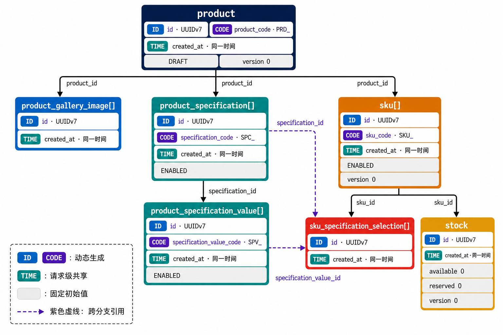

# 商品

## 创建商品

```json
{
  "title": "纯棉 T 恤",
  "subtitle": "柔软透气",
  "description": "100% 纯棉",
  "categoryCode": "TSHIRT",
  "primaryImageFileId": "0195d7d2-6380-7a5c-8b35-3a23b8df1f01",
  "galleryImageFileIds": [
    "0195d7d2-6380-7a5c-8b35-3a23b8df1f02",
    "0195d7d2-6380-7a5c-8b35-3a23b8df1f03"
  ],
  "specifications": [
    {
      "name": "颜色",
      "values": ["黑色", "白色"]
    },
    {
      "name": "尺码",
      "values": ["M", "L"]
    }
  ],
  "skus": [
    {
      "merchantSkuCode": "TSHIRT-BLACK-M",
      "price": 99.00,
      "imageFileId": "0195d7d2-6380-7a5c-8b35-3a23b8df1f04",
      "selections": [
        {
          "specification": "颜色",
          "value": "黑色"
        },
        {
          "specification": "尺码",
          "value": "M"
        }
      ]
    },
    {
      "merchantSkuCode": "TSHIRT-WHITE-L",
      "price": 109.00,
      "imageFileId": "0195d7d2-6380-7a5c-8b35-3a23b8df1f05",
      "selections": [
        {
          "specification": "颜色",
          "value": "白色"
        },
        {
          "specification": "尺码",
          "value": "L"
        }
      ]
    }
  ]
}
```

### 字段校验

有效文本：去除首尾空白后非空。

| 字段 | 必填 | 校验规则 |
| --- | --- | --- |
| `title` | 是 | 有效文本，最多 50 个字符 |
| `subtitle` | 否 | 有效文本，最多 50 个字符 |
| `description` | 是 | 有效文本，最多 5000 个字符 |
| `categoryCode` | 是 | 有效文本，最多 64 个字符 |
| `primaryImageFileId` | 是 | UUIDv7 |
| `galleryImageFileIds` | 否 | UUIDv7 数组，默认空数组 |
| `specifications` | 否 | 默认空数组 |
| `specifications[].name` | 是 | 有效文本，最多 50 个字符 |
| `specifications[].values` | 是 | 非空数组 |
| `specifications[].values[]` | 是 | 有效文本，最多 50 个字符 |
| `skus` | 是 | 非空数组 |
| `skus[].merchantSkuCode` | 否 | 有效文本，最多 64 个字符 |
| `skus[].price` | 是 | `0 < price <= 99999999.99`，最多 2 位小数 |
| `skus[].imageFileId` | 否 | UUIDv7 |
| `skus[].selections` | 否 | 默认空数组 |
| `skus[].selections[].specification` | 是 | 有效文本，最多 50 个字符 |
| `skus[].selections[].value` | 是 | 有效文本，最多 50 个字符 |

### 约束

- 轮播图 ID 不重复。
- 规格名称不重复。
- 同一规格内的规格值不重复。
- 非空 `merchantSkuCode` 不重复。
- SKU 规格组合不重复，选择顺序不影响组合判定。
- 无规格商品只能有一个 SKU，且该 SKU 无规格选择。
- 有规格商品的每个 SKU 必须为每个规格选择一个规格值。
- SKU 选择的规格及规格值必须存在于商品规格定义中。

### 映射依赖

#### 依赖关系



#### PO 构造函数

```text
convert(input) -> ProductCreationPos
├── product = mkProduct(...)
├── galleryImages = mkProductGalleryImages(...)
├── specifications = mkProductSpecifications(...)
│   └── List<ProductSpecificationPos>
├── skus = mkSkus(...)
│   └── List<SkuPos>
└── toProductCreationPos(product, galleryImages, specifications, skus)
```

##### ProductCreationPos

```java
public class ProductCreationPos {
    private ProductPO product;
    private List<ProductGalleryImagePO> productGalleryImages;
    private List<ProductSpecificationPO> productSpecifications;
    private List<ProductSpecificationValuePO> productSpecificationValues;
    private List<SkuPO> skus;
    private List<SkuSpecificationSelectionPO> skuSpecificationSelections;
    private List<StockPO> stocks;
}
```

##### ProductSpecificationPos

```java
public record ProductSpecificationPos(
    ProductSpecificationPO specification,
    List<ProductSpecificationValuePO> values
) {
}
```

##### SkuPos

```java
public record SkuPos(
    SkuPO sku,
    List<SkuSpecificationSelectionPO> specificationSelections,
    StockPO stock
) {
}
```

##### 转换

```text
toProductCreationPos(
    product,
    galleryImages,
    specifications,
    skus
) -> ProductCreationPos
```

##### 商品

```text
mkProduct(
    id,
    productCode,
    createdAt,
    productInput
) -> ProductPO
```

##### 轮播图

```text
mkProductGalleryImages(
    productId,
    createdAt,
    imageInputs
) -> List<ProductGalleryImagePO>

mkProductGalleryImage(
    id,
    productId,
    createdAt,
    imageInput
) -> ProductGalleryImagePO
```

##### 规格与规格值

```text
mkProductSpecifications(
    productId,
    createdAt,
    specificationInputs
) -> List<ProductSpecificationPos>

mkProductSpecification(
    productId,
    createdAt,
    specificationInput,
    sortOrder
) -> ProductSpecificationPos

mkProductSpecificationPo(
    id,
    productId,
    specificationCode,
    createdAt,
    specificationInput
) -> ProductSpecificationPO

mkProductSpecificationValue(
    id,
    specificationId,
    specificationValueCode,
    createdAt,
    specificationValueInput
) -> ProductSpecificationValuePO
```

##### SKU、规格选择与库存

```text
mkSkus(
    productId,
    createdAt,
    skuInputs,
    specificationIndex
) -> List<SkuPos>

mkSku(
    productId,
    createdAt,
    skuInput,
    specificationIndex
) -> SkuPos

mkSkuPo(
    id,
    productId,
    skuCode,
    createdAt,
    skuInput
) -> SkuPO

mkSkuSpecificationSelection(
    id,
    skuId,
    specificationId,
    specificationValueId,
    createdAt
) -> SkuSpecificationSelectionPO

mkStock(
    id,
    skuId,
    createdAt
) -> StockPO
```

##### 构造约束

- 单数 PO 构造函数为纯函数。
- ID、Code 和创建时间由调用方传入。
- 不执行校验或持久化操作。
- 固定初始值在 PO 构造时写入。

#### 生成值

Request 不提供内部 ID、业务 Code、时间、状态、版本和初始库存，这些值由系统在映射时补充。

`product`

| 字段 | 类型 | 生成方式或值 |
| --- | --- | --- |
| `id` | 动态 | UUIDv7 |
| `product_code` | 动态 | `PRD_` 前缀业务 Code |
| `status` | 固定 | `DRAFT` |
| `version` | 固定 | `0` |
| `created_at` | 动态 | 本次创建时间 |
| `updated_at` | 动态 | 本次创建时间 |

`product_gallery_image`

| 字段 | 类型 | 生成方式或值 |
| --- | --- | --- |
| `id` | 动态 | UUIDv7 |
| `created_at` | 动态 | 本次创建时间 |

`product_specification`

| 字段 | 类型 | 生成方式或值 |
| --- | --- | --- |
| `id` | 动态 | UUIDv7 |
| `specification_code` | 动态 | `SPC_` 前缀业务 Code |
| `status` | 固定 | `ENABLED` |
| `created_at` | 动态 | 本次创建时间 |
| `updated_at` | 动态 | 本次创建时间 |

`product_specification_value`

| 字段 | 类型 | 生成方式或值 |
| --- | --- | --- |
| `id` | 动态 | UUIDv7 |
| `specification_value_code` | 动态 | `SPV_` 前缀业务 Code |
| `status` | 固定 | `ENABLED` |
| `created_at` | 动态 | 本次创建时间 |
| `updated_at` | 动态 | 本次创建时间 |

`sku`

| 字段 | 类型 | 生成方式或值 |
| --- | --- | --- |
| `id` | 动态 | UUIDv7 |
| `sku_code` | 动态 | `SKU_` 前缀业务 Code |
| `status` | 固定 | `ENABLED` |
| `version` | 固定 | `0` |
| `created_at` | 动态 | 本次创建时间 |
| `updated_at` | 动态 | 本次创建时间 |

`sku_specification_selection`

| 字段 | 类型 | 生成方式或值 |
| --- | --- | --- |
| `id` | 动态 | UUIDv7 |
| `created_at` | 动态 | 本次创建时间 |

`stock`

| 字段 | 类型 | 生成方式或值 |
| --- | --- | --- |
| `id` | 动态 | UUIDv7 |
| `available_quantity` | 固定 | `0` |
| `reserved_quantity` | 固定 | `0` |
| `version` | 固定 | `0` |
| `created_at` | 动态 | 本次创建时间 |
| `updated_at` | 动态 | 本次创建时间 |

每次创建请求只获取一次当前时间，所有表共用该时间。除时间外，动态值按各自记录生成。

`sort_order`、`price_amount` 和各外键不是系统生成值：它们分别由数组顺序、请求价格和已生成的关联身份推导得到。

#### 规格选择索引

```text
(specificationName, specificationValue) -> (specificationId, specificationValueId)
```

### 持久化结果

#### `product`

创建 1 条记录。

| 字段 | 来源或初始值 |
| --- | --- |
| `id` | 系统生成 |
| `product_code` | 系统生成 |
| `status` | `DRAFT` |
| `title` | `title` |
| `subtitle` | `subtitle` |
| `description` | `description` |
| `category_code` | `categoryCode` |
| `primary_image_file_id` | `primaryImageFileId` |
| `version` | `0` |
| `created_at` | 当前时间 |
| `updated_at` | 当前时间 |

#### `product_gallery_image`

每个 `galleryImageFileIds` 元素创建 1 条记录。

| 字段 | 来源或初始值 |
| --- | --- |
| `id` | 系统生成 |
| `product_id` | 商品内部 ID |
| `file_id` | `galleryImageFileIds[]` |
| `sort_order` | 元素在数组中的下标 |
| `created_at` | 当前时间 |

#### `product_specification`

每个 `specifications` 元素创建 1 条记录。

| 字段 | 来源或初始值 |
| --- | --- |
| `id` | 系统生成 |
| `product_id` | 商品内部 ID |
| `specification_code` | 系统生成 |
| `name` | `specifications[].name` |
| `status` | `ENABLED` |
| `sort_order` | 规格在数组中的下标 |
| `created_at` | 当前时间 |
| `updated_at` | 当前时间 |

#### `product_specification_value`

每个 `specifications[].values` 元素创建 1 条记录。

| 字段 | 来源或初始值 |
| --- | --- |
| `id` | 系统生成 |
| `specification_id` | 所属规格内部 ID |
| `specification_value_code` | 系统生成 |
| `display_name` | `specifications[].values[]` |
| `status` | `ENABLED` |
| `sort_order` | 规格值在数组中的下标 |
| `created_at` | 当前时间 |
| `updated_at` | 当前时间 |

#### `sku`

每个 `skus` 元素创建 1 条记录。

| 字段 | 来源或初始值 |
| --- | --- |
| `id` | 系统生成 |
| `product_id` | 商品内部 ID |
| `sku_code` | 系统生成 |
| `merchant_sku_code` | `skus[].merchantSkuCode` |
| `status` | `ENABLED` |
| `price_amount` | `skus[].price × 100` |
| `image_file_id` | `skus[].imageFileId` |
| `version` | `0` |
| `created_at` | 当前时间 |
| `updated_at` | 当前时间 |

#### `sku_specification_selection`

每个 `skus[].selections` 元素创建 1 条记录。

| 字段 | 来源或初始值 |
| --- | --- |
| `id` | 系统生成 |
| `sku_id` | 所属 SKU 内部 ID |
| `specification_id` | `specification` 对应的规格内部 ID |
| `specification_value_id` | `value` 对应的规格值内部 ID |
| `created_at` | 当前时间 |

#### `stock`

每个 SKU 创建 1 条记录。

| 字段 | 来源或初始值 |
| --- | --- |
| `id` | 系统生成 |
| `sku_id` | 所属 SKU 内部 ID |
| `available_quantity` | `0` |
| `reserved_quantity` | `0` |
| `version` | `0` |
| `created_at` | 当前时间 |
| `updated_at` | 当前时间 |

- 类目和文件资源只保存引用，不创建新记录。
- 以上数据在同一事务中全部成功或全部失败。
