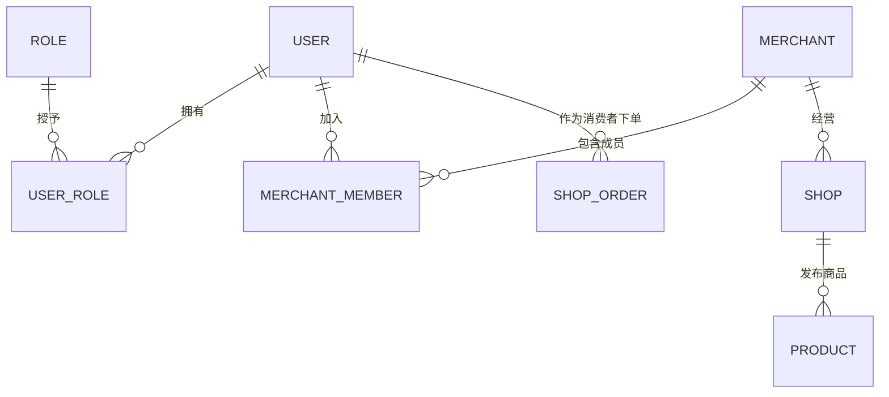

# FluxMart 用户设计

## 1. 设计目标

FluxMart 是一个支持商家入驻和消费者购物的电商平台。用户系统需要支持：

- 用户注册、登录和身份认证
- 消费者浏览商品、下单、支付和申请售后
- 商家创建店铺、发布商品和处理订单
- 多个用户共同管理同一家店铺
- 平台运营人员进行审核和后台管理
- 同一个用户同时拥有消费者和商家身份

## 2. 用户类型

从业务参与者来看，系统主要包含三类用户：

| 类型 | 说明 | 主要能力 |
| --- | --- | --- |
| 消费者 | 在平台购买商品的用户 | 下单、支付、退款、评价 |
| 商家人员 | 代表商家或店铺经营的用户 | 管理商品、库存、订单和售后 |
| 平台人员 | FluxMart 的运营和管理员 | 审核商家、治理商品、处理平台事务 |

消费者和商家人员不是互斥类型。同一个账号可以在购买商品的同时，作为某家店铺的经营者。

## 3. 核心建模原则

系统只建立一套统一账号体系，不分别建立“客户账号表”和“商家账号表”。

```text
用户账号
  ├── 拥有平台角色：消费者、平台管理员等
  └── 加入商家/店铺：店主、管理员、客服、商品运营等
```

需要区分以下概念：

- `User`：可以登录系统的自然人账号
- `Role`：账号拥有的平台级权限角色
- `Merchant`：入驻平台并承担经营及结算责任的经营主体
- `Shop`：面向消费者展示和销售商品的店铺
- `MerchantMember`：用户与商家之间的成员关系和权限

商家不应只是用户表中的一个 `is_merchant` 字段。商家可能是个人、企业或其他经营主体，也可能由多个用户共同管理。

## 4. 第一阶段角色

第一阶段定义以下平台角色：

```text
CUSTOMER       消费者
PLATFORM_ADMIN 平台管理员
```

商家内部角色通过成员关系表达：

```text
OWNER           店主/商家负责人
ADMIN           商家管理员
PRODUCT_MANAGER 商品运营
ORDER_MANAGER   订单及售后人员
CUSTOMER_SERVICE 客服
```

第一版可以只实现 `OWNER`，但数据结构应允许后续增加其他成员角色。

## 5. 核心实体关系



## 6. 建议数据表

### 6.1 用户表 `user_account`

| 字段 | 说明 |
| --- | --- |
| `id` | 用户主键 |
| `username` | 登录名，可选 |
| `phone` | 手机号 |
| `email` | 邮箱 |
| `password_hash` | 密码哈希，禁止保存明文密码 |
| `nickname` | 昵称 |
| `avatar_url` | 头像地址 |
| `status` | `ACTIVE`、`DISABLED`、`LOCKED` |
| `last_login_at` | 最后登录时间 |
| `created_at` | 创建时间 |
| `updated_at` | 更新时间 |

手机号和邮箱都属于可选登录凭证，但填写后必须建立唯一约束。第一阶段可以只选择一种主要登录方式。

### 6.2 角色表 `role`

| 字段 | 说明 |
| --- | --- |
| `id` | 角色主键 |
| `code` | 唯一角色编码 |
| `name` | 角色名称 |

### 6.3 用户角色表 `user_role`

| 字段 | 说明 |
| --- | --- |
| `user_id` | 用户 ID |
| `role_id` | 角色 ID |

`user_id + role_id` 建立联合唯一约束。

### 6.4 商家表 `merchant`

| 字段 | 说明 |
| --- | --- |
| `id` | 商家主键 |
| `merchant_no` | 对外商家编号 |
| `name` | 商家名称 |
| `type` | `INDIVIDUAL` 或 `ENTERPRISE` |
| `status` | `PENDING`、`ACTIVE`、`REJECTED`、`SUSPENDED` |
| `contact_name` | 联系人姓名 |
| `contact_phone` | 联系电话 |
| `created_at` | 创建时间 |
| `updated_at` | 更新时间 |

证件、营业执照和结算账户等敏感资料后续单独设计，不直接堆积在商家主表中。

### 6.5 商家成员表 `merchant_member`

| 字段 | 说明 |
| --- | --- |
| `id` | 主键 |
| `merchant_id` | 商家 ID |
| `user_id` | 用户 ID |
| `role` | 商家内部角色 |
| `status` | `ACTIVE`、`INVITED`、`DISABLED` |
| `joined_at` | 加入时间 |

`merchant_id + user_id` 建立联合唯一约束。

### 6.6 店铺表 `shop`

| 字段 | 说明 |
| --- | --- |
| `id` | 店铺主键 |
| `merchant_id` | 所属商家 |
| `shop_no` | 对外店铺编号 |
| `name` | 店铺名称 |
| `logo_url` | 店铺 Logo |
| `status` | `PENDING`、`OPEN`、`CLOSED`、`SUSPENDED` |
| `created_at` | 创建时间 |
| `updated_at` | 更新时间 |

第一阶段可以限制一个商家只有一家店铺，但不应在数据模型上把商家与店铺合并，以便以后支持多店铺。

## 7. 第一阶段最小范围

为了尽快完成商品下单和支付闭环，第一阶段可以实现：

1. 用户账号注册和登录
2. 用户默认拥有消费者身份
3. 用户申请成为商家并创建一家店铺
4. 商家申请通过后，申请人成为该商家的 `OWNER`
5. 店主可以发布和管理自己店铺的商品
6. 用户可以购买其他店铺的商品
7. 平台管理员可以审核商家和停用异常账号

第一阶段暂不实现：

- 第三方账号登录
- 企业实名认证和电子合同
- 商家子账号的细粒度权限配置
- 多店铺经营
- 复杂组织架构
- 会员等级和成长体系

## 8. 关键业务规则

- 用户身份与商家主体分离，删除或停用用户不能导致商家交易数据消失。
- 同一个用户可以管理多个商家，同一个商家也可以拥有多个成员。
- 消费者下单时保存用户 ID；订单收货人信息需要作为订单快照单独保存。
- 商家只能操作自己所属商家或店铺的数据，所有管理接口必须校验成员关系。
- 平台角色与商家内部角色分开授权，避免商家权限扩大为平台权限。
- 用户、商家和店铺采用状态控制，历史交易数据原则上不做物理删除。

## 9. 待确认问题

- 第一阶段使用手机号、邮箱还是用户名作为主要登录方式？
- 是否允许一个用户创建多个商家主体？
- 商家入驻是否需要平台管理员审核？
- 第一阶段是否需要商家子账号，还是只有店主一个管理账号？
- 平台第一阶段是自营商城，还是允许第三方商家真实入驻？
